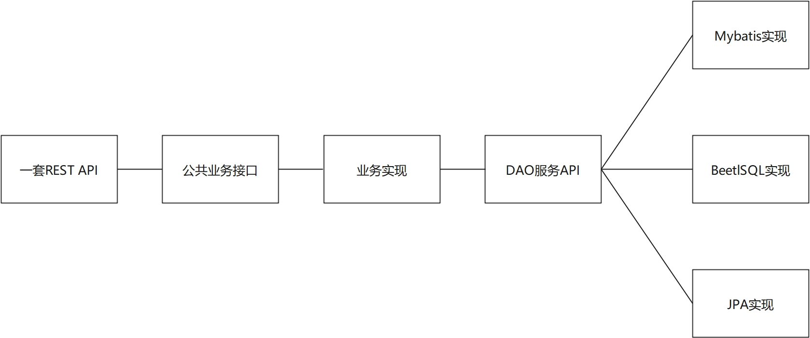
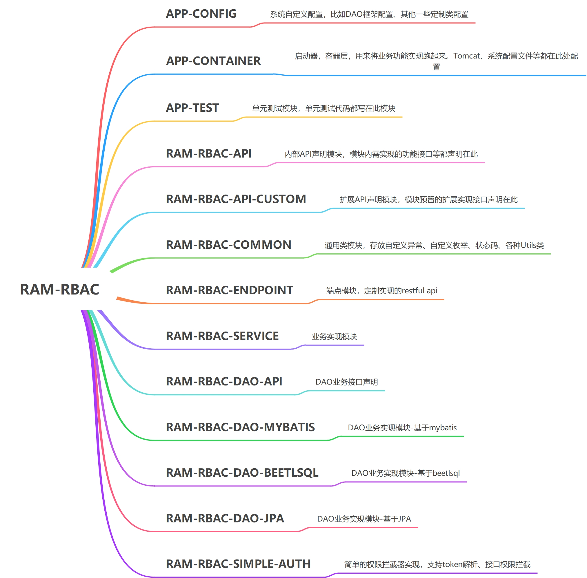

# ram-rbac
RAM开发框架-RBAC基础模块简单实现。主要功能有：
1. 系统KV字典管理
2. 权限管理
3. 角色管理-角色权限授权
4. 用户管理-用户角色授权
5. 凭证管理-踢出凭证
6. 系统设定
7. 验证码实现（待完善）

为了考虑通用性，计划提供3个不同DAO框架的实现：Mybatis实现和BeetlSQL实现、JPA实现。

## 项目架构简介

整体思想：



根据个人口味，可以选择以上任一分支的DAO实现。
目前已完成Mybatis分支，BeetlSQL分支自定义分页还存在少许问题，JPA分支将在未来实现。


## 项目源码结构



## 使用方法

此基础模块，请确保在RAM开发框架中使用，以确保最大兼容性，如果非RAM开发框架，在标准的springboot工程中亦可使用
，但需要配置好所需属性值，同时，由于存在的各种基础依赖版本不一致，也有可能造成兼容问题。

RAM开发框架提供了一组原型工程，可以使用原型工程，初始化项目工程，原型工程一般默认集成rbac基础模块：


| 原型类型 | 项目地址 |
|  ----  | ----  |
| ram-webapp-with-mybatis | [https://github.com/mbc3320/ram-webapp-with-mybatis.git](https://github.com/mbc3320/ram-webapp-with-mybatis.git) |
| ram-webapp-with-mybatis-and-ui | 待开发 |
| ram-webapp-with-beetlsql | 待开发 |
| ram-webapp-with-beetlsql-and-ui | 待开发 |
| ram-webapp-with-jpa | 待开发 |
| ram-webapp-with-jpa-and-ui | 待开发 |


### 根pom配置

在项目的根pom增加如下配置：

注意：根pom最好继承spring-boot-starter-parent。

```xml
<parent>
    <groupId>org.springframework.boot</groupId>
    <artifactId>spring-boot-starter-parent</artifactId>
    <version>2.3.12.RELEASE</version>
        <!-- lookup parent from repository -->
</parent>
```

#### 选用mybatis实现

```xml
<properties>
    <ram-bom.version>1.0.2</ram-bom.version>
    <ram-common.version>1.0.2</ram-common.version>
    <ram-config-web.version>1.0.2</ram-config-web.version>
    <ram-config-redis.version>1.0.2</ram-config-redis.version>
    <ram-config-mybatis.version>1.0.2</ram-config-mybatis.version>
    <ram-rbac.version>1.0.1</ram-rbac.version>
</properties>
```

```xml
<dependencyManagement>
    <dependencies>
        <dependency>
            <groupId>top.beanshell</groupId>
            <artifactId>ram-bom</artifactId>
            <version>${ram-bom.version}</version>
            <type>pom</type>
            <scope>import</scope>
        </dependency>
        <dependency>
            <groupId>top.beanshell</groupId>
            <artifactId>ram-common</artifactId>
            <version>${ram-common.version}</version>
        </dependency>
        <dependency>
            <groupId>top.beanshell</groupId>
            <artifactId>ram-config-web</artifactId>
            <version>${ram-config-web.version}</version>
        </dependency>
        <dependency>
            <groupId>top.beanshell</groupId>
            <artifactId>ram-config-redis</artifactId>
            <version>${ram-config-redis.version}</version>
        </dependency>
        <dependency>
            <groupId>top.beanshell</groupId>
            <artifactId>ram-config-mybatis</artifactId>
            <version>${ram-config-mybatis.version}</version>
        </dependency>
        <dependency>
            <groupId>top.beanshell</groupId>
            <artifactId>ram-rbac-api</artifactId>
            <version>${ram-rbac.version}</version>
        </dependency>
        <dependency>
            <groupId>top.beanshell</groupId>
            <artifactId>ram-rbac-api-custom</artifactId>
            <version>${ram-rbac.version}</version>
        </dependency>
        <dependency>
            <groupId>top.beanshell</groupId>
            <artifactId>ram-rbac-common</artifactId>
            <version>${ram-rbac.version}</version>
        </dependency>
        <dependency>
            <groupId>top.beanshell</groupId>
            <artifactId>ram-rbac-endpoint</artifactId>
            <version>${ram-rbac.version}</version>
        </dependency>
        <dependency>
            <groupId>top.beanshell</groupId>
            <artifactId>ram-rbac-service</artifactId>
            <version>${ram-rbac.version}</version>
        </dependency>
        <dependency>
            <groupId>top.beanshell</groupId>
            <artifactId>ram-rbac-dao-mybatis</artifactId>
            <version>${ram-rbac.version}</version>
        </dependency>
        <dependency>
            <groupId>top.beanshell</groupId>
            <artifactId>ram-rbac-auth</artifactId>
            <version>${ram-rbac.version}</version>
        </dependency>
    </dependencies>
</dependencyManagement>
```

#### 选用beetlsql实现

```xml
<properties>
    <ram-bom.version>1.0.2</ram-bom.version>
    <ram-common.version>1.0.2</ram-common.version>
    <ram-config-web.version>1.0.2</ram-config-web.version>
    <ram-config-redis.version>1.0.2</ram-config-redis.version>
    <ram-config-beetlsql.version>1.0.2</ram-config-beetlsql.version>
    <ram-rbac.version>1.0.1</ram-rbac.version>
</properties>
```

```xml
<dependencyManagement>
    <dependencies>
        <dependency>
            <groupId>top.beanshell</groupId>
            <artifactId>ram-bom</artifactId>
            <version>${ram-bom.version}</version>
            <type>pom</type>
            <scope>import</scope>
        </dependency>
        <dependency>
            <groupId>top.beanshell</groupId>
            <artifactId>ram-common</artifactId>
            <version>${ram-common.version}</version>
        </dependency>
        <dependency>
            <groupId>top.beanshell</groupId>
            <artifactId>ram-config-web</artifactId>
            <version>${ram-config-web.version}</version>
        </dependency>
        <dependency>
            <groupId>top.beanshell</groupId>
            <artifactId>ram-config-redis</artifactId>
            <version>${ram-config-redis.version}</version>
        </dependency>
        <dependency>
            <groupId>top.beanshell</groupId>
            <artifactId>ram-config-beetlsql</artifactId>
            <version>${ram-config-beetlsql.version}</version>
        </dependency>
        <dependency>
            <groupId>top.beanshell</groupId>
            <artifactId>ram-rbac-api</artifactId>
            <version>${ram-rbac.version}</version>
        </dependency>
        <dependency>
            <groupId>top.beanshell</groupId>
            <artifactId>ram-rbac-api-custom</artifactId>
            <version>${ram-rbac.version}</version>
        </dependency>
        <dependency>
            <groupId>top.beanshell</groupId>
            <artifactId>ram-rbac-common</artifactId>
            <version>${ram-rbac.version}</version>
        </dependency>
        <dependency>
            <groupId>top.beanshell</groupId>
            <artifactId>ram-rbac-endpoint</artifactId>
            <version>${ram-rbac.version}</version>
        </dependency>
        <dependency>
            <groupId>top.beanshell</groupId>
            <artifactId>ram-rbac-service</artifactId>
            <version>${ram-rbac.version}</version>
        </dependency>
        <dependency>
            <groupId>top.beanshell</groupId>
            <artifactId>ram-rbac-dao-beetlsql</artifactId>
            <version>${ram-rbac.version}</version>
        </dependency>
        <dependency>
            <groupId>top.beanshell</groupId>
            <artifactId>ram-rbac-simple-auth</artifactId>
            <version>${ram-rbac.version}</version>
        </dependency>
    </dependencies>
</dependencyManagement>
```

#### 选用JPA实现

待完善

### 启动容器模块配置

在根pom配置好以上依赖声明，就可以将以下依赖配置到app-container模块即可：

```xml
<dependencies>
    <dependency>
        <groupId>top.beanshell</groupId>
        <artifactId>ram-rbac-endpoint</artifactId>
    </dependency>
    <dependency>
        <groupId>top.beanshell</groupId>
        <artifactId>ram-rbac-service</artifactId>
    </dependency>
    <dependency>
        <!-- 基于mybatis的DAO业务实现，其他DAO框架请替换mybatis为beetlsql、jpa 即可  -->
        <groupId>top.beanshell</groupId>
        <artifactId>ram-rbac-dao-mybatis</artifactId>
    </dependency>
    <dependency>
        <groupId>top.beanshell</groupId>
        <artifactId>ram-rbac-simple-auth</artifactId>
    </dependency>
</dependencies>
```

### 自定义业务模块配置

在业务功能实现的子模块内，如需调用rbac基础模块的实现，仅需依赖接口，注入接口实例，即可调用已完成的业务功能：

```xml
<dependencies>
    <dependency>
        <groupId>top.beanshell</groupId>
        <artifactId>ram-rbac-api</artifactId>
    </dependency>
    <!-- 系统保留的一些扩展接口， 按需引用 并实现 -->
    <dependency>
        <groupId>top.beanshell</groupId>
        <artifactId>ram-rbac-api-custom</artifactId>
    </dependency>
</dependencies>
```

## 初始化数据库

请根据doc/sql 文件夹下的sql脚本初始化数据库，ram-rbac-init-table-vx.y.z.sql 为数据表初始化脚本，
ram-rbac-init-data-vx.y.z.sql为初始数据初始化脚本。
doc/sql/update 目录下的sql脚本为版本升级sql脚本，如有版本升级需要，则在此目录找到对应的升级脚本。

## 默认用户

默认管理员账号为 **admin/Ram2021**

也可以自己根据 app-test/src/test/java/top/beanshell/AppBootstrapTest.java 文件的 initAdminUser 方法初始化一个管理员账号。

注意：线上系统切勿使用admin账号作为系统管理员， 请初始化系统之后，重新创建一个账户，授权系统管理员角色，再将admin账号删除！！！
